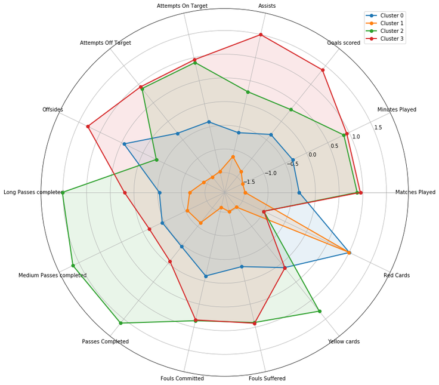

# Clustering FIFA World Cup 2018 Players with K-Means

## Summary
Clustering aims to group a set of items into “clusters”, such that items belonging to a cluster are more similar than those items not belonging to that same cluster. In this report, we attempt to perform unsupervised clustering to FIFA world cup 2018 players based on their statistics.

We scraped player stats from FIFA's website. Players were clustered through the k-Means algorithm. The optimal number of clusters was determined to be 4 based on internal validation criteria. Exploring the stats of each cluster, we have identified each cluster to be the following types of players:

1. Aggressive Defenders
2. Midfielders
3. Defensive-minded defenders but not necessarily playmakers
4. Experienced Offensive players

## Data Description
Our experiment made use of player stats from FIFA 2018 world cup players. The dataset is composed of 604 players and 14 attributes per player that was scraped from https://www.mykhel.com/football/fifa-world-cup-2018-player-stats-l4/. The following player attributes were selected for this study:

* Matches Played
* Minutes Played
* Goals scored
* Assists
* Attempts On Target
* Attempts Off Target
* Offsides
* Long Passes completed
* Medium Passes completed
* Passes Completed
* Fouls Committed
* Fouls Suffered
* Yellow cards
* Red Cards

## Exploratory Data Analysis
Below are the histograms showing the number of players vs value per attribute.

Unsupervised Clustering
k -Means Clustering and Internal Validation Metrics
To determine the optimal number of clusters, we have based our analysis on 3 internal validation metrics:

Inertia. Corresponds to the sum of squares distances from the centroids of each cluster. Smaller values of inertia indicate better clustering.

Intracluster to intercluster distance ratio.The ratio of the average distance of randomly-sampled pairs $P$ that belongs to the same cluster, and the average distance of randomly-sampled pairs $Q$ that belong to different clusters. Smaller values suggest better clustering. The IID ratio is computed by:

Overall Silhouette coefficient. The average of silhouette coefficients of all points. The silhouette coefficient of a point is computed by:

where $Davg^{in}_i$ be the average distance of $x_i$ to data points within the cluster of $x_i$, and $Dmin^{out}_i$ be the smallest average distance to points other than its own cluster. A value that is closer to 1 indicates better clustering.

With the goal of minimizing both inertia and IICD score while maximizing the silhouette coefficient. The following can be observed from the plot:

Inertia values begin to elbow at  $k$=4. After that, only small incremental decreases in inertia values happen as the number of clusters is increased. IICD score dips at 4 clusters, increases at 5, and continuously declines as the number of clusters increase. Although both inertia and IICD score decreases as the number of clusters of increase, the silhouette score is farther from the desired value of 1 as we increase the number of clusters. This suggests that the optimal number of clusters is 4.

## Visualizing on Principal Components
Through Principal Component Analysis (PCA) we are also interested in determining the features that influence the clustering.

The result indicates that the 95.53 of the variance can only be explained by 10 principal components. Also, 55.29% of the variation can already be explained by 2 principal components:

Plotting the transformed points in the first two PCs:

The plot suggests that the labels can be clearly distinguished. We examined the linear combinations of the features along the two PCs below:

## Exploratory Analysis of Clusters
We want to extend our analysis by making a collective description of each cluster by examining how do attributes of one cluster compare to the other. We did several visualizations on the stats of each cluster to uncover latent properties.

### Count of elements for each cluster

### Comparison of Cluster Attributes
We show the histograms of features color-coded per cluster derived by kMeans:

As another way to visualize the different attributes associated with each cluster, we plotted the boxplots per attribute showing the values for the four clusters.

We show a heat map showing cluster 1 has low values for almost all attributes except red cards. Cluster 2 has the most number of passes. Cluster 3 has the most goals and assists. And cluster 0 has some offsides and red cards but generally even for all attributes.

Finally, we show the radar chart showing the values per attribute for each of the four clusters.

## Analysis

### Cluster 0: Defensive-minded Midfielders but not necessarily playmakers

Average stats across the board with the most notable being their higher number of offsides and red cards. Their passes and shots are minimal which may mean that they are defensive-minded players. This may also mean that they play defense most of the time to tire out opponents before they launch a quick counter to score a goal. They may be midfielders who are not necessarily playmakers.

### Cluster 1: Aggressive Defenders

This cluster has fewer assists, passes, and goal attempts, the usual stats of a defender. Usually, a defender’s sole responsibility is to help the keeper protect the goal which explains why their stats are high in tackles and interceptions. Almost all the time, defenders commit disciplinary records due to dangerous tackles and fouls. The fouls they committed seem to be serious since they have the fewest number of games played. With them having more assists and passes than shots, coupled with the fact that they have the red cards, they are aggressive defenders.

### Cluster 2: Midfielders

The second highest in terms of matches played, the highest number of passes and second highest in terms of shots placed, it can mean that they’re midfielders. The role of a midfielder is to distribute the ball and create plays and may take shots if they want to. The players in this cluster are the ones who support/set-up plays because of their high number of passes and multiple attempts on scoring. Since their goals scored is relatively low, they may have either faced good keepers or the quality of their shots might not be too good. It can be noted that their assists are low, so this cluster most probably have strikers whose chances were not converted into goals due to the same reason.

### Cluster 3: Experienced Offensive Players

Having the most shots taken, goals scored, and offsides, these are the forward players/those primarily playing offensive roles. They have the fewest red cards, the most number of attempts, and scored the most number of goals. The players in this cluster are mostly strikers due to the following reasons:

* They suffered the most number of fouls, which happens to almost every striker since they typically become targets of defenders to dispossess
* Their offside counts are also high since it is the strikers that usually commit offsides
* A high number of attempts and goals since scoring goals are the primary role of a striker.

## References and Acknowledgements
Prof. Christian Alis, lecture and source codes on Representative Based clustering, Crio Sevilla and Dominic Gacad, Futsal varsity players of UA&P for teaching us some technical terms in soccer helping us interpret the stats of the clusters.

Contributors: Prince Javier and Jayson Yodico
