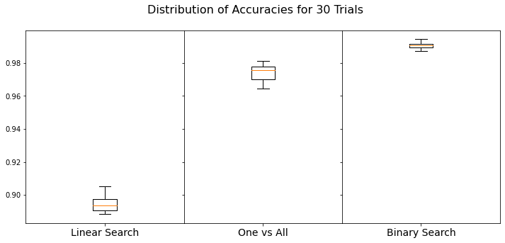
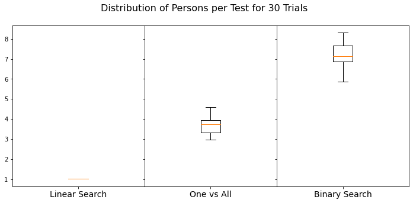
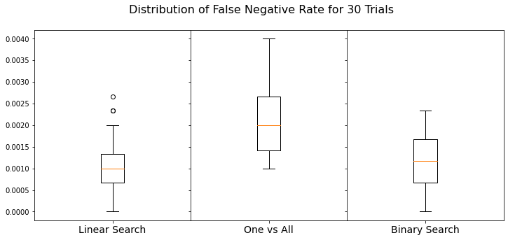
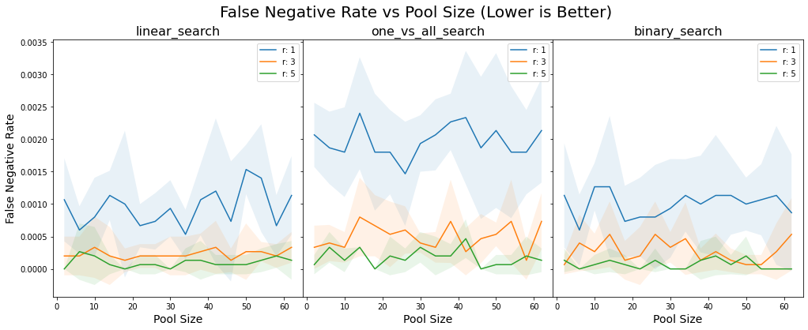
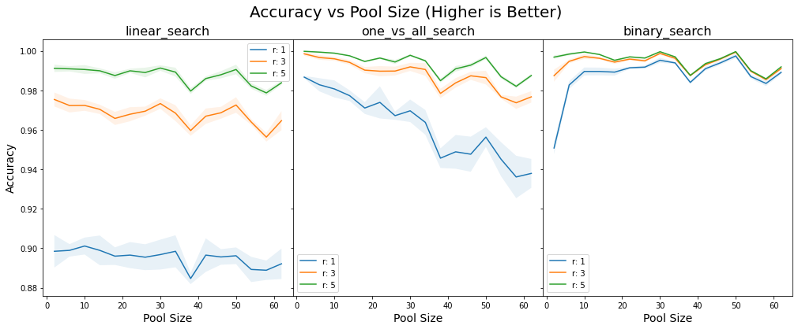
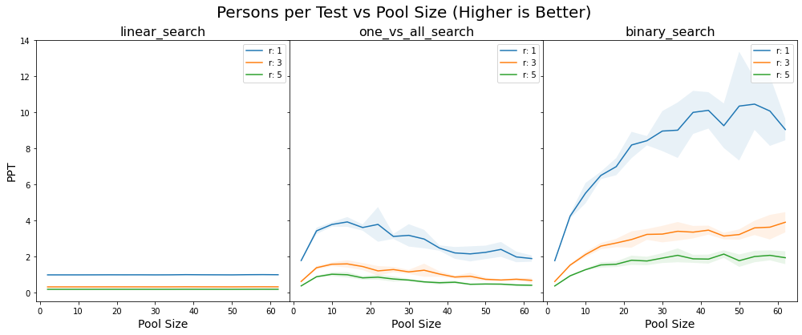
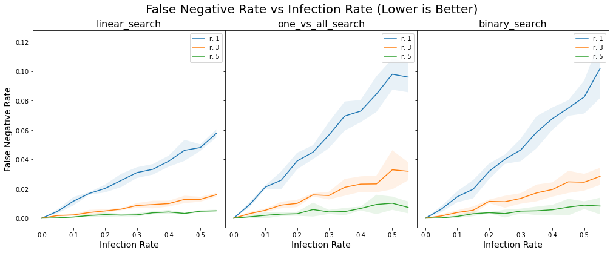
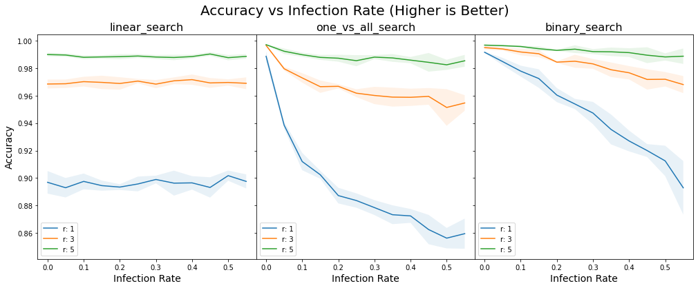
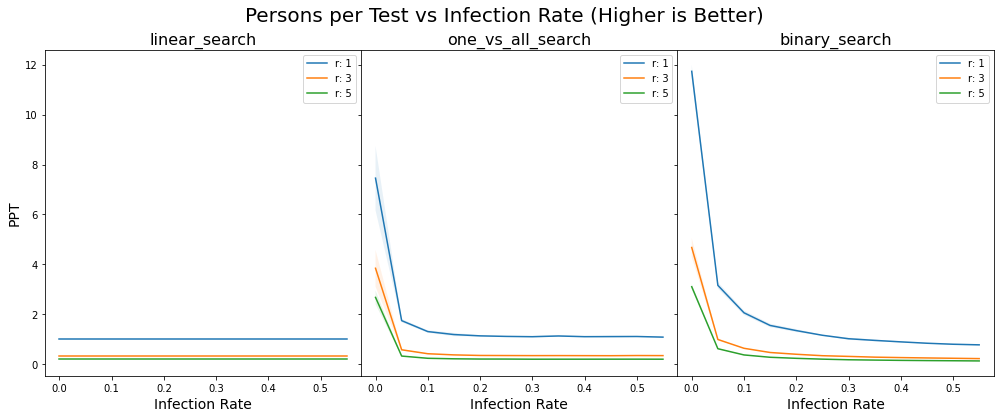

# Optimizing Pool Size for COVID Testing by Binary Search
by Titus Jungao and Prince Javier
 Last Updated: April 5, 2020
 [Colab Notebook](https://colab.research.google.com/drive/1uKidRGS3OOp9WE45Y3dtDX5f1-g1iXon?fbclid=IwAR18X-EXtjPrQQCFqtM0HMBKFwRncoSDc9zq0syOhczmvx1YgSzyRefWOq0#scrollTo=rOK4tIwhEmTz)

## Introduction

There are over 3000 confirmed COVID cases in the Philippines as of April 5, 2020. However, this figure might underreport the actual number of cases. In response to calls on social media to increase the number of persons tested, the DOH announced on April 3 that "mass testing" is ongoing and around 16,000 people have already been tested.

Because mass testing will require resources such as COVID kits and health workers, smart implementation methods must be explored. Here, we explore the application of the binary search algorithm as an alternative to testing people one by one. 

We prepared a numerical simulation of the binary search algorithm. The algorithm works this way:
1. Given population `P` and the fraction of infected `i`, we randomly select `w` persons for testing. 
2. We combine or 'pool' the samples from each user into a single sample for testing.
3. `r` COVID test kits with certain false positive and false negative rates are used for this pooled sample.
4. If more than 50% of the `r` tests register negative, all persons in the pool are considered negative, otherwise, we split the pool into two groups
5. For each group, apply steps 2 to 5

### Inputs and Outputs

Given:
* `P` - population
* `i` - fraction of infected people in the population
* `fpr` - COVID test kit false positive rate
* `fnr` - COVID test kit false negative rate
* `w` - initial pool size, e.g. 32 people then binary search algorithm splits into 16, and then 8, 4, and finally 2.
* `r` - no. of replicates or "tests" on a pool sample

We compute:
* `PPT` - average number of persons that will be tested by each test kit
* `FNR` - false negative rate. Propotion of infected individuals missed by pooled testing
* `ACC` - accuracy of testing computed by (num correct results/total results)
* `w_opt` - optimal pool size

## Simulation Results

## Sample Analysis

If we implement random mass testing using binary search algorithm starting with 16 persons for a community of 3000 with an estimated infection rate of 1% and using one test kit per sample pool, we may expect an efficiency gain of 1.9X over One-vs-All search and more than 7X over testing individuals one by one (linear search).

Put this another way, given the same number of test kits, we may expect almost a two-fold increase in the number of people tested over One-vs-All search and a 7-fold increase over linear search.

Given test kits with 10% false positive rate and 10% false negative rate, we get around 0.08% false negative rate using Binary Search or Linear Search and 0.18% `FNR` using one-vs-all search.

From our sensitivity analyses and given the same assumptions as above, we find that:
* `FNR` is stable over different `w` for all three search methods
* `FNR` is severely impacted by `r` for One-Vs-All search. The impact of `r` is smaller for both linear search and binary search
* Binary search has consistently the highest accuracies over different `w`. The effect of `r` is more significant for linear search and one-vs-all search vs binary search
* `PPT` consistently increases with higher `w` for binary search. Intuitively, `PPT` of linear search is not affected while `PPT` of one-vs-all search peaks at a certain `w` then goes down for higher `w`.
* Linear search is more stable over increasing infection rates `i` compared to both one-vs-all and binary search
* Accuracy of linear search is stable over infection rates, while the accuracy decreases with higher `i` for both binary search and one-vs-all search. However, the decline is smaller for binary search.
* `PPTs` of both binary search and one-vs-all search are severely impacted by increasing `i`. At infection rates between 30-40%, `PPT` of binary search falls below linear search and one-vs-all search.

We have shown that binary search performs consistently on par or better than linear search or one-vs-all search in terms of accuracy, `FNR`, and `PPT` Binary search may be a viable option for mass testing for COVID if the proportion of infected is below 30%.

## References
 https://arxiv.org/abs/2003.09944
 https://www.rappler.com/nation/255060-math-model-coronavirus-cases-metro-manila-could-peak-mid-april-not-contained
 https://www.doh.gov.ph/2019-nCoV
 https://www.cnnphilippines.com/news/2020/4/3/coronavirus-mass-testing-philippines.html
 https://www.weforum.org/agenda/2020/03/south-korea-covid-19-containment-testing/
 https://www.cnnphilippines.com/news/2020/4/3/coronavirus-mass-testing-philippines.html

## Disclaimer
We do not claim that the values our model will predict are absolute truths nor do we claim that the code we prepared are free of bugs. Feel free to examine the code.
 Our model, assumptions, and sample analysis have not been verified by epidemiologists. The assumptions in our model can be tweaked as needed.
 We assume that the test kit performance will be the same whether or not the sample is pooled. We did not take into consideration any possible change in test kit accuracy if we pool up samples rather than test each user one by one. 
