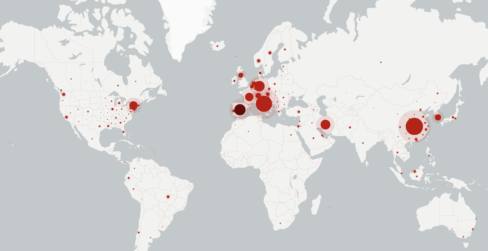
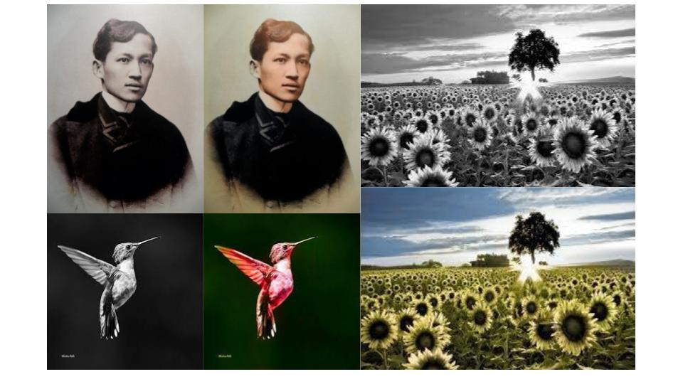
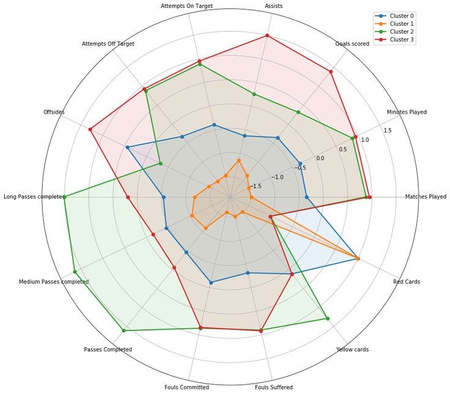

I am an engineer, data scientist, and cofounder of Bridge360, a tech startup based in the Philippines that provides tech solutions to businesses. Bridge 360 also holds tech, social, and environmental meetups and workshops. 
  Aside from our startup, I work as a data scientist at Mynt, a top FinTech company in the Philippines. Before venturing into data science, my line of work was in engineering design, project management, and financial modeling. 
  <a href="https://www.linkedin.com/in/princejavier/">View My LinkedIn Profile</a>

---

### Published Articles

[Recent Trends in AI and their Use in Organizations](https://artificial-intelligence.apacciooutlook.com/cxoinsights/recent-trends-in-ai-and-their-use-in-organizations-nwid-7221.html?fbclid=IwAR2OU07vVNlYw-6jKYstqu4YGEB_anMxhr9z_QDIgojIIgjWBCBcnyDD0dQ)
 
[A Millenial Engineer’s Guide To The Role of Mining In Society](https://gineersnow.com/industries/mining/millenial-engineers-guide-role-mining-society#comments)

### Presentation Slides
[What is Data Science - PSHS YMSAT Week 2020](/pshs_talk_datascience/index)

### Blogs
[Towards Good Data Visualization](/revamp_data_viz_talk/index)
 [Why Science is Flawed, But That's Alright](/blogs/why_science_is_flawed)
 [Reflections on Per Bak's How Nature Works](/blogs/how_nature_works)
 [Complex Systems: An Emerging Paradigm](/blogs/complex_systems_paradigm)
 [Questions on the Danger of Data](/blogs/danger_of_data)

### Projects
[nCOV Visualization](/ncov_viz/index)

 
[nCOV Tracker](/ncov_tracker/index)

 
[AISda - AI that recognizes and counts fish](/AIsda/index)

 
[Automatic Image Colorization with AI](/colorizer/index)

 
[Clustering FIFA World Cup 2018 Players with K-Means](/cluster_fifa/index)

 
