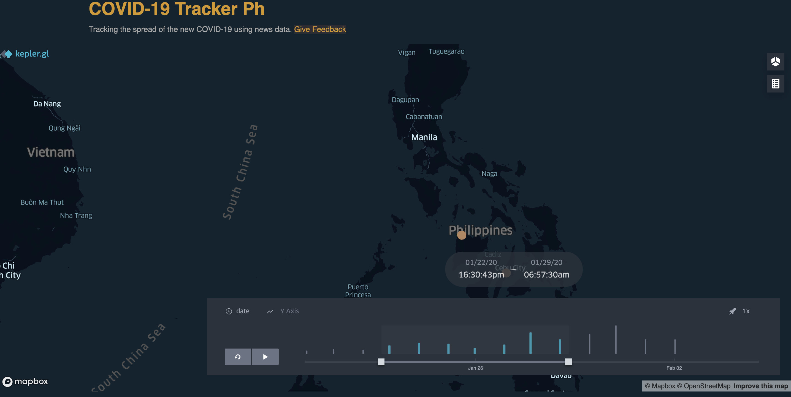

# Corona Virus Tracker

I collaborated with [Mago Analytics](https://twitter.com/magoanalytics) for an interactive dashboard for tracking the spread of the 2019 Wuhan Coronavirus in the Philippines using just news reports. 

Reports related to the coronavirus in the Philippiens are regularly scraped from the internet and GDELT dataset. The articles are then parsed to find the number of suspected and confirmed cases. The data are then visualized using kepler.gl, Uber's open source visualization tool based on MapBox.

You can find the work-in-progress tracker here: [COVID-19 Tracker](https://ncov-tracker.herokuapp.com/)

