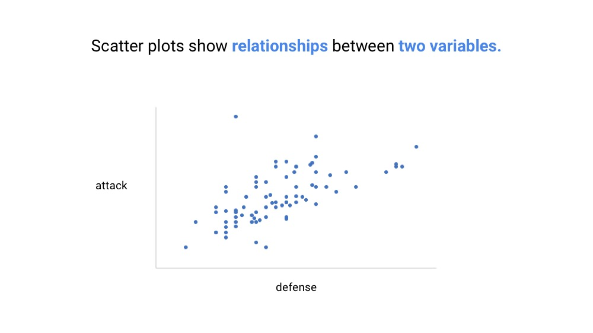

# Towards Good Data Visualization
Originally Presented at ReVamp QA Day Event, Makati, Philippines
Oct 19, 2018

## Data and society

We are the only species capable of creating massive infrastructures, terraforming the Earth, and creating new materials. We are the only mammals that’s able to form massive groups and cooperate, forming corporations, religious organizations, and countries. We are the only species that has reached outer space and even landed on the moon. Our robots have reached other neighboring planets, asteroids, and satellites.

We have sent our information to the peripheries of our solar system through the golden record inside the Voyager space craft launched in 1977 in hopes of preserving our species progress. 

And it seems we are the only species on Earth capable of creating a new form of intelligence or even a new life form. An artificial intelligence.

No other species on Earth has come even close to what we have done. So what set our species apart? What did we have the enabled us to group together by the millions and achieve extraordinary technological feats? 

**It had a lot to do with our ability to store, communicate, and propagate information.**

In terms of social connections, people have a natural limit of 150. This is famously called Dunbar's number. So how come we were able to form countries with millions of people? The answer is in shared beliefs that such a country exists. In our case, the belief in a country called the Philippines rests upon some writings on a small book called the constitution. It wasn’t drafted by everyone. Instead, it was drafted by a few who are said to be representatives of millions of people. 

The idea of shared beliefs to form large groups not only applies to countries but to other organizations as well such as corporations and non-profit groups. We believe such organizations exist and that we are part of them.

Shared beliefs create massive groups beyond the natural social limit of 150. This allows for unprecedented collaboration and generation of ideas that propel our knowledge and technology forward.

What enabled us to share and propagate shared beliefs is our capacity to store and share information over space and time. And civilizations from those of Mesopotamia and ancient Egypt up to today are founded on stored and shared information. From cave paintings of bulls, Baybayin on copper plates, hieroglyphs of Egypt to programming languages and mathematical formulas on chalk boards.

Because of this, we can answer the questions, "What have our ancestors found out?" and "What have we found out to share to our descendants?"

## We are primed for images and stories

We are naturally predisposed to understand images. From an evolution perspective, it’s easy to understand how eyesight could have been helpful in looking far for food or predators. It’s also no wonder some of the earliest writings like the Egyptian hieroglyphs are in image form and some of the earliest records in caves are drawings of animals and imprints of hands. 

We are normally visual creatures. In fact, we process pictures very fast - 60,000 times faster than words and numbers.

They say a picture is worth a thousand words? It’s not - because it’s worth 60,000.

Secondly, our brains evolved to tell and remember stories. Which is why some of the earliest known histories have been passed through stories from epics memorized by Babaylans of the Philippines, Homer’s Odyssey, to the oral tradition of the Old Testament.

We just get images and stories. How can we leverage this to improve data visualization and communication?

## We live with big data

We live at an unprecedented time. We are swimming in data. There are currently over 7 billion people, and 4 billion of us use the internet. The sheer rate at which information is being generated is mind boggling. 

To give us a bit of perspective, each minute, we generate 300k FB posts, 500k photos in Snapchat, 450k Tweets, and 2.4 million Google searches.

And it’s only expected to grow exponentially. 90% of all data we have were generated only in the last 2 years! This is just the data on the internet. What about data generated internally in organizations? 

We are swimming in data. But do we make sense out of them? Do we extract insights that can inform us and guide our actions and our organizations? Remember that it’s sharing of information that sustains organizations.

But how can we make sense of all the data being generated and share them? How can we leverage our brain’s natural capacity to quickly understand images and to remember stories?

**The key is effective data visualization and storytelling.**

More and more organizations and people are finding the need to effectively communicate insights from data. If we look at Google searches worldwide for the term ‘data visualization’, we find that they are steadily increasing, which tells us about the  increasing interest.

## Easy to Make Means Easy to Mess Up

Thankfully, we have the tools to visualize data faster than ever. Charts that took days to manually draw can now be generated with the click of a mouse button. 

However, since making charts is easy, we run the risk of not paying much attention to crafting them. In effect, we find ourselves making many ugly charts that we put into our PowerPoint slides.

Yale Professor and author of the influential book, Envisioning Information, once said “Power corrupts. PowerPoint corrupts absolutely.”

It’s so easy to make charts and slap them into our PowerPoint slides. But that doesn’t mean that they are effective in getting information across. It’s easy to set up and easy to mess up. 

**How do we know if a chart’s good? The answer is if it’s easy to understand.**

## Four-Step Data Visualization Framework

How do we make better charts? We can use Cole Knaflic’s 4-step data visualization framework. 

The four steps are:

* Understand the context - who is the audience, what do they need to know or do?
* Choose the appropriate charts - should this be a bar chart, a line chart, a heat map?
* Eliminate clutter and focus attention - how we can reduce visual elements and focus audience attention
* Tell a story - how can we connect with people at an emotional level?

With these frameworks our aim is to make better charts that communicate effectively to drive decisions and action. Let's start with the first step - understand the context.

### Understand the Context

Understanding the context means looking at the big picture. Looking at the problem or issue and everything around it from a bird’s eye view. We first want to understand the audience, our desired outcomes, the story we are going to tell, and the data we will use to support our story.

First we have to know whom we will be communicating with. Is it grade schoolers, college students? Teachers? Are they from rural or urban areas? Are they from the government or private sector?

We identify who are the decision-makers. Who have the say whether to push your proposed solution or not?

Segment your audience. Define them as clearly as possible. Before you make charts, you should know for whom you will be making your charts in the first place!

Once you have identified your audience, the next step is to define your story. What do you want your audience to know or do?

One way to help you with this is to answer: 
* Why should they care about what you say?
* What does the desired outcome look like?

Strip down into only the most important bits. Try to summarize your story in 3 minutes. In one sentence, what does your audience need to know? Give your unique point of view, tell what is at stake, and state this in a complete sentence.

Summarizing into three minutes and into just one sentence will help clarify your story and identify the most important parts. Always remember the desired outcome you want from your audience. Do you want them to do something? To know something?

Now that you know your audience and what you want to tell them, identify your approach. How are you going to tell your story? Will this be a live presentation? Will this be through a written document? What will the tone be like? Will it be fun? Serious? Again, this will depend on the audience and what you want them to do.

Finally, answer "which data will help me drive my point?" Make sure that you don’t cherry pick your data and that your data is reliable and gives a complete picture.

One way to help you identify your approach and how your will frame your story is through storyboarding.

Understanding the context means looking at the big picture. Doing so guides you to making the right data visualization and story to tell.

### Choose the appropriate charts

There are hundreds of charts and ways one can visualize information. We will focus on seven of the most used charts. What are they and when do we use each one of them?

We start with basic text. Sometimes, we don’t need fancy visuals if we want to show say a single number. Large text can be simple yet powerful way to get your message across.

Scatterplots show the relationships between two variables. In a scatterplot, each datapoint has two values. One value is on the horizontal axis while the other is on the vertical axis. In this case, we see that in general, defense increases with attack. 

A line chart is used to visualize trends in data over time. Financial data like stock prices, profit, inflation rates and foreign exchanges are often plotted this way. Populations over time are also plotted this way.

This way, we can see if our value is going up or down over time.

Similar to a line chart, a slope chart is used to visualize trends in data over time. Only in this case, we are looking at only two points in time. This is useful in a quick look at which improved or worsened over the past year or month.

If we have multiple categories and we want to compare their values, we use a bar chart. While line, slope, and scatter plot charts deal solely with numbers. Bar charts deal with categories with numerical values. Typically, a horizontal bar chart is easier to read than a vertical bar chart.

Similar to a bar chart, square area charts compare values of two or more categories. However, if the difference in values are so large that using a bar chart will make the other bar look too small, the extra dimension of a square area makes visualization more effective for those cases.

Heat maps show distribution of values over an area. For example, the distribution of rainfall over the Philippines may use a heat map superimposed over the map of the Philippines. Distribution of elevations of mountains can also fall under a heat map, though they are a special case called topographic maps.

Any table can be converted to a heat map in order to emphasize certain numbers that are too high or too low.

### Eliminate Clutter and Focus Attention

We want to make communication as effective as possible. This means retaining only the necessary elements in our data visualizations.

Just like Marie Kondo, we have to ask, does this spark joy? Or can we remove that element? 

We want to minimize the visual elements to maximize understanding. We want to eliminate the so called cognitive burden.  When we say cognitive burden, we refer to the effort we need to exert to understand a certain visual.

We can make use of Gestalt principles of visual perception to help us figure out which visual elements to remove. 

‘Gestalt’ is a German word meaning ‘unified whole.’ Gestalt principles aim to define rules by which we perceive things. 

Try to look at the shapes above. To the left most what do you see? At the center? To the right?

Most of us will see a 3D box, an inverted triangle and a sphere even if they are not there! Gestalt principles tell us that we don’t need to complete shapes for us to perceive them. Hints that they exist are enough and our minds fill in the blanks.

This insight can be useful in our objective to minimize visual elements while maximizing understanding. We can eliminate visual elements and just rely on our minds' ability to fill in the blanks!

Finally, we want to focus our audience’s attention. Decluttering is not enough. Guiding their perception towards the key elements is necessary. To do so, we can apply certain design techniques such as changing contrasts, colors, shapes, and font styles.

#### Data Viz Makeover

Now that we know the most important charts to use as well as techniques to improve visuals, let’s put them all together with an example. 

Below is a chart showing proportions of pokemon Types. Let's say that we want to show what the three most common types are. What do you think can be improved in this chart?

Below is an animation showing how I applied Gestalt principles to remove clutter and contrasts on color to focus attention.

Finally, below is the chart before and after our quick makeover.

We have improved our chart by changing the chart type from a pie chart to a bar chart, used Gestalt principles to eliminate unnecessary visual elements and finally, used colors strategically to focus the audience’s attention on the most important parts of the visualization. Effectively, we have improved the visuals while at the same time, reducing the reader’s cognitive load.

### Tell a Story
The final part of any data visualization project is the story. Again, it is not enough to show the data. People remember stories especially those that connect emotionally. We make our decisions mostly out of emotions and not reason. We have shown them the data to tap into their reason, what kind of story will we tell them to tap into their emotion?

Stories are about restoring balance. There is a status quo that has been disrupted. How does one get back to status quo? There is a journey that has encountered conflicts. How does one resolve these? There is an expectation that has not been met? How does one meet those expectations?

A good story is about conflict and how to resolve them. If your story is about met expectations, then that is not a very good story. What people want to hear are those that surprise them. There is almost no point in telling a story that everybody expected. The sales went up as expected, good. But what if the sales went up twice faster than expected? Now that’s surprising and everybody would love to hear about that. Or what if the sales were not meeting expectations? Everybody will want to know why as well. 

Frame your data visualizations around a story. Start with the imbalance -- what changed? Why should they care? Then talk about the insights you got from your data. Support your stories with hard facts. Explain your proposed course of action. Then finally, ask the audience what their decision or action will be. 

Every data visualization presentation needs to have an outcome. Remember that the very first part is identifying the desired outcome? Ask that from your audience. 

What is their takeaway? What is your call to action?

## You Try It!

Below are some charts from the Philippine Statistics Authority website. Can you improve these charts using the 4-step framework? 

You can also look for other charts that you would love to improve. **If you're willing to share your work, I'd love to see them and showcase them in this blog!**

Kindly email your data vizzes to iambridge360@gmail.com.

## References
Storytelling with Data by Cole Knaflic

